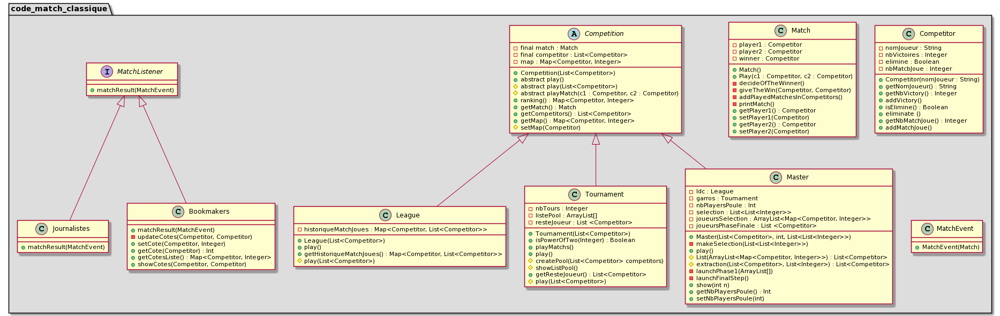

# BILLOUARD-BEVILACQUA-COO-Projet

## Présentation 

Ce projet de COO correspond à la gestion d'une compétition sportive. Elle est définie par un ensemble de matchs (Match) joués entre compétiteurs (Competitor). La compétition est responsable de l’organisation de ses matchs. Autrement dit, c’est elle qui fait jouer ses matchs. La méthode play() déroule donc une compétition jusqu’à son terme, c’est à dire lorsque tous les matchs ont été joués et qu’un vainqueur est désigné. 

## Diagramme de classe associé au projet



## Pour commencer

Ouvrez un terminal et **placez-vous dans le dossier où vous voulez que le dépôt soit cloné**. Exécutez la commande suivante : 

``` git
git clone https://gitlab-etu.fil.univ-lille1.fr/billouard/billouard-bevilacqua-coo-projet.git
```
Placez vous désormais dans le terminal dans le dossier BILLOUARD-BEVILACQUA-COO-Projet et considérez cet emplacement comme la racine du dossier.
A la racine du projet dans un terminal et installer le .jar : 
```console 
wget http://www.fil.univ-lille1.fr/~routier/enseignement/licence/poo/tdtp/test4poo.jar 
``` 
### Version avec Makefile 

## All 
(All permet de faire toute la démo en une commande.)
Pour compiler les classes, générer la documentation, les executables, la compilation des tests et leurs éxécution, il faut se positionner à la racine du projet et lancer la commande : 
```console 
make all
``` 
## Détaillé 

Se positionner à la racine du projet. 
Pour compiler les fichiers, il faut exécuter la commande suivante : 
```console 
make classes
``` 
Les fichiers compilés sont donc maintenant dans le dossier classes.

Placez vous dans le dossier src, et exécuter la commande suivante dans un terminal :
```console 
make doc
``` 
Pour rendre le fichier .jar exécutable et générer l'archive des .class de toutes les classes de core_match_classique et util (Competition, Competitor, ...), exécuter la commande suivante aprés avoir compilé les classes.
```console 
make exe
``` 
Pour exécuter le main de la classe Compeition avec le fichier .jar, il faut d'abord compiler les fichiers générés et générer le fichier .jar exécutable. (voir partie précédente). Puis exécuter la commande suivante dans un terminal situé à la racine du projet :
```console 
make competition
``` 
Pour extraire le .jar dans le dossier temp exécutez ceci dans un terminal :
```console 
make extract
``` 
Pour compiler les tests, placez vous à la racine du projet dans un terminal et exécuter la commande suivante :
```console 
make compTest
``` 
Note pour compTest: 
Le message peut s'afficher selon la version de Java que vous avez :
```console
Note: Some input files use unchecked or unsafe operations.
```
Cela se produit en Java 5. De plus avec l'utilisation des collections sans spécification de type. Cela signifie que le compilateur ne peut pas vérifier que vous utilisez la collection d'une manière sûre du point de vue du type, en utilisant des génériques.
Exemple : 
```java
List myList = new ArrayList();
```
au lieu de : 
```java
List<String> myList = new ArrayList<String>();
```

Pour exécuter les tests, il faut d'abord compiler les tests. (voir partie précédente).
Placez vous à la racine du projet dans un terminal.
Pour exécuter les tests, exécuter la commande suivante :
```console 
make test
``` 
### Version sans Makefile
### Compiler les fichiers 

Pour compiler les fichiers, il faut exécuter la commande suivante **en vous plaçant dans le dossier src du projet** dans un terminal : 

``` console
javac core_match_classique/*.java util/*.java -d ../classes
```

Les fichiers compilés sont donc maintenant dans le dossier classes.

### Générer la documentation 

**Placez vous dans le dossier src**, et exécuter la commande suivante dans un terminal :

``` console
javadoc -d ../docs -sourcepath . -subpackages core_match_classique:util
```

### Générer l'archive .jar

Pour générer l'archive des .class de toutes les classes de core_match_classique et util (Competition, Competitor, ...), il faut **se placer dans le dossier classes** et exécuter la commande suivante aprés avoir compilé les classes : 

``` console
jar cvf ../appli.jar core_match_classique/*.class util/*.class
```

Pour visualiser le contenu de .jar, **placez vous à la racine du projet** et exécutez la commande suivante : 

``` console
jar tvf appli.jar
```

Pour rendre le fichier .jar exécutable, exécuter ceci dans un terminal **en vous plançant dans le dossier classes** : 

``` console
jar cmf ../manifest.mf ../appli.jar core_match_classique/*.class util/*.class
```

Le fichier .jar est désormais exécutable.

### Exécuter les fichiers 

##### Sans le fichier .jar

Pour exécuter le main de la classe Competition il faut d'abord compiler les fichiers. (voir partie précédente). Puis exécuter la commande suivante dans un terminal **situé dans le dossier classes** : 

``` console 
java core_match_classique.main -classpath /core_match_classique/*.class /util/*.class
```

##### Depuis le fichier .jar :

Pour exécuter le main de la classe Compeition avec le fichier .jar, il faut d'abord compiler les fichiers générés et générer le fichier .jar exécutable. (voir partie précédente). Puis exécuter la commande suivante dans un terminal **situé à la racine du projet** :  

``` console
java -jar appli.jar
```

#### Extraire le .jar

**Placez vous dans le dossier temp** et exécutez ceci dans un terminal : 

``` console
jar xvf ../appli.jar
```

### Compiler les tests 

Pour compiler les tests, placez vous à la racine du projet dans un terminal et exécuter la commande suivante : 

``` console
javac -cp test4poo.jar:src/ test/*.java
```

### Exécuter les tests 

Pour exécuter les tests, il faut d'abord compiler les tests. (voir partie précédente).

Placez vous à la racine du projet dans un terminal.

Pour exécuter les tests de League, exécuter la commande suivante : 
```console
java -jar test4poo.jar LeagueTest
```

Pour exécuter les tests de Match, exécuter la commande suivante : 
```console
java -jar test4poo.jar MatchTest
```

Pour exécuter les tests de Competitor, exécuter la commande suivante : 
```console
java -jar test4poo.jar CompetitorTest
```
A REVOIR CAR NE FONCTIONNE PLUS
Pour exécuter les tests de Competition, exécuter la commande suivante : 
```console
java -jar test4poo.jar CompetitionTest
```

Pour exécuter les tests de Tournaments, exécuter la commande suivante : 
```console
java -jar test4poo.jar TournamentsTest
```

Pour exécuter les tests de UnautorizedPlayersMatchExceptionTest, exécuter la commande suivante : 
```console
java -jar test4poo.jar UnautorizedPlayersMatchExceptionTest
```

Pour exécuter les tests de MasterTest, exécuter la commande suivante : 
```console
java -jar test4poo.jar MasterTest
```

Pour exécuter les tests de MasterTest, exécuter la commande suivante : 
```console
java -jar test4poo.jar ObserverTest
```